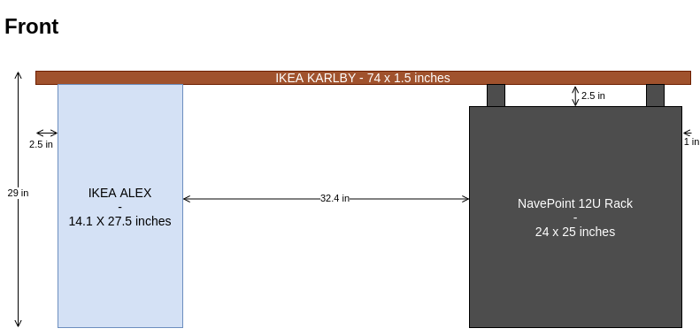
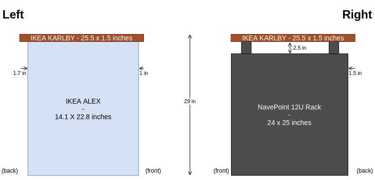
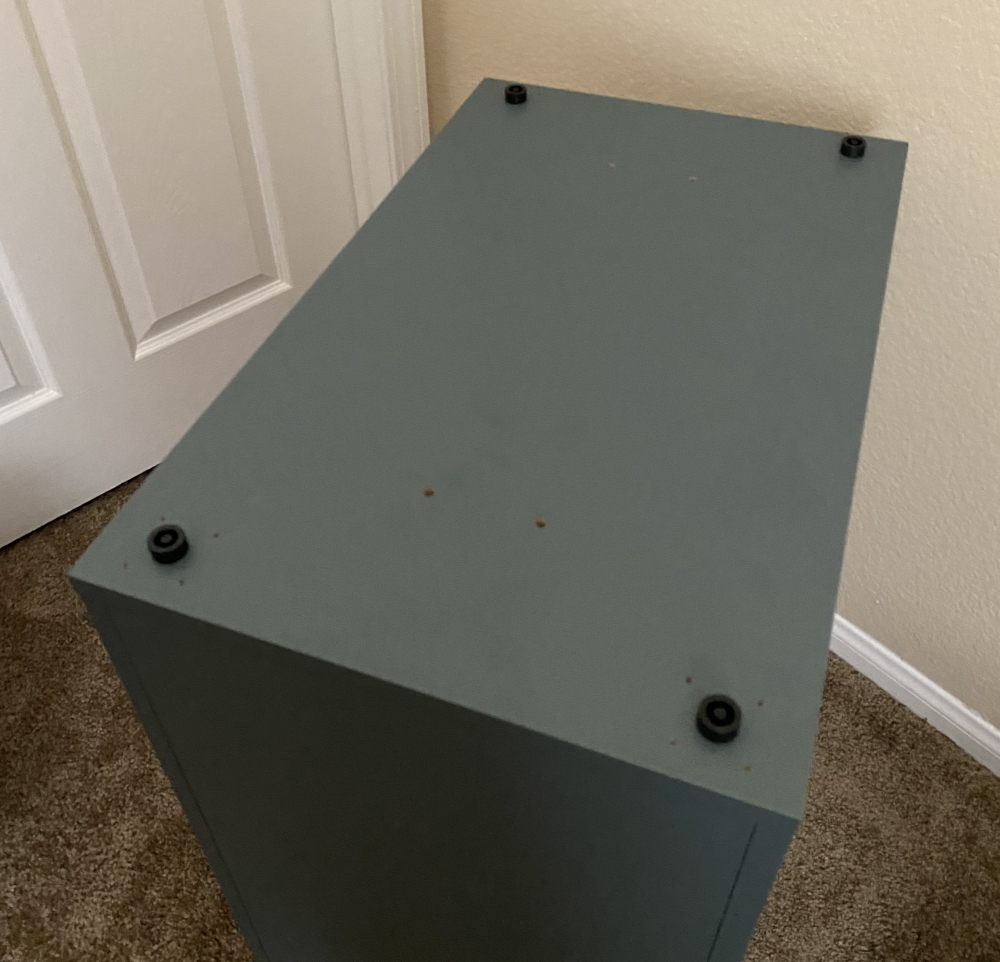
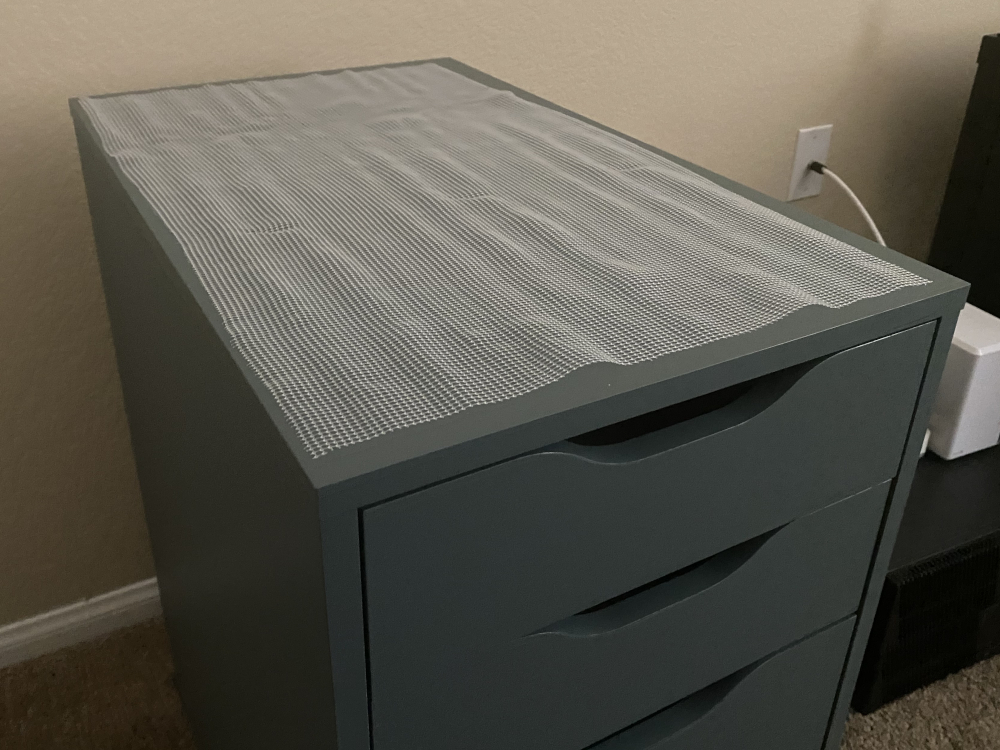
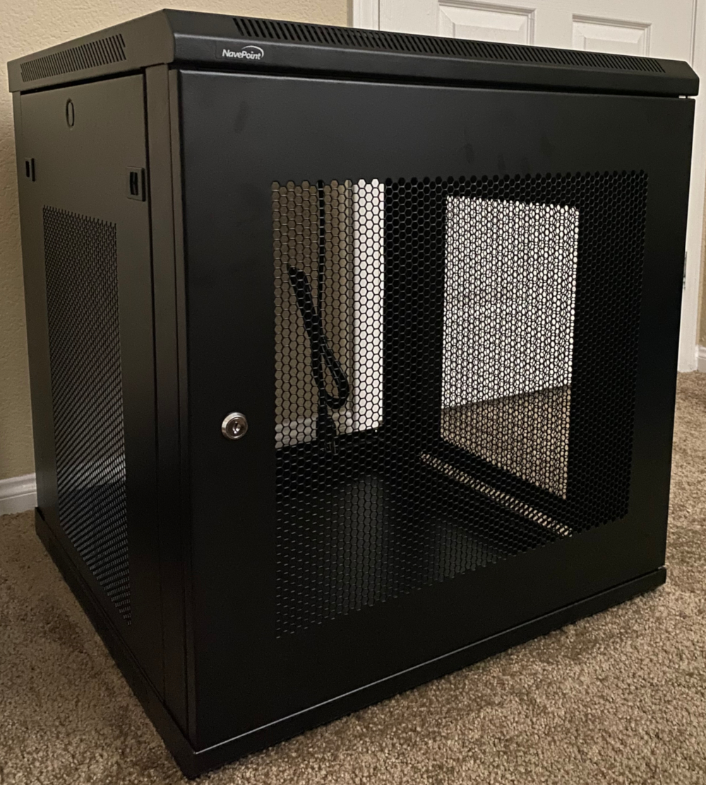
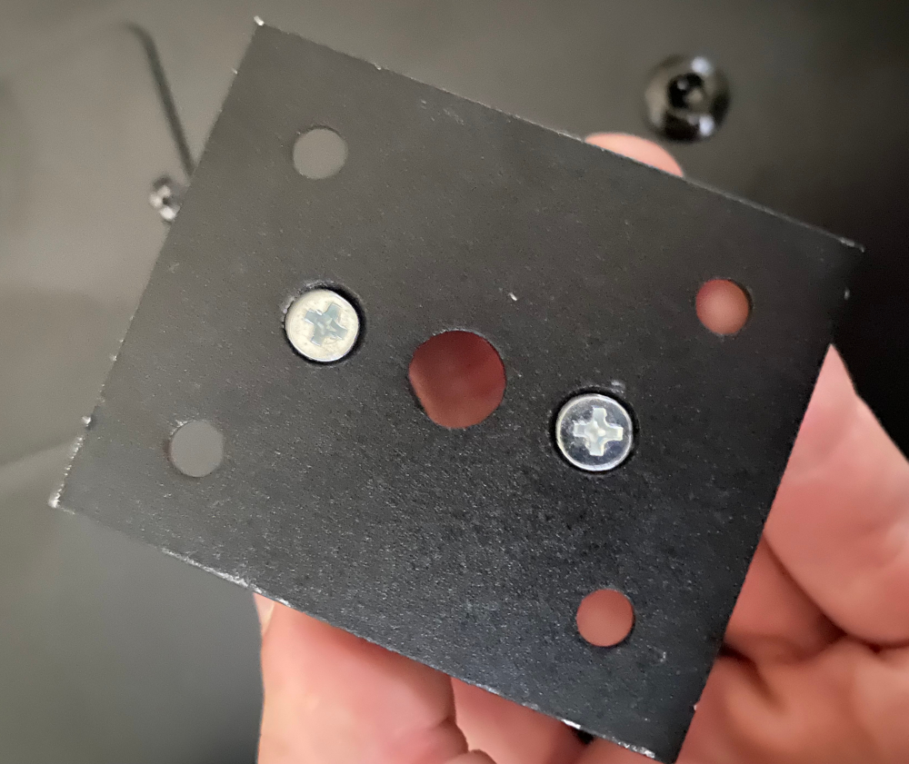
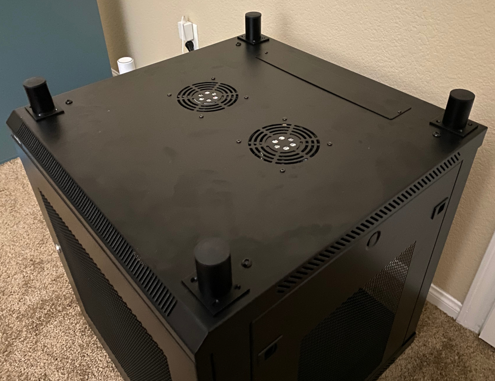
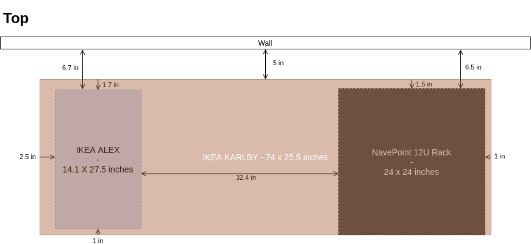

# Homelab Desk

A homelabber's take on the popular DIY IKEA ALEX-KARLBY desk including a 12U network rack.

## Components

Typical ALEX-KARLBY desk builds use two ALEX drawer units as legs supporting the KARLBY countertop. In this homelab variation, only one is used; the other is replaced with a 12U network rack.

- [IKEA ALEX drawer unit](https://www.ikea.com/us/en/p/alex-drawer-unit-gray-turquoise-30483799/)
- [IKEA KARLBY countertop](https://www.ikea.com/us/en/p/karlby-countertop-walnut-veneer-50335208/)
- [NavePoint 12U Network Rack](https://navepoint.com/navepoint-12u-600mm-depth-wallmount-networking-perforated-cabinet-pro-series/)
- [2 inch adjustable furniture feet](https://www.amazon.com/dp/B092884B9G/ref=cm_sw_em_r_mt_dp_D365HPTV2TWYZDB7A4S8)
- [IKEA STOPP anti-slip mat](https://www.ikea.com/us/en/p/stopp-anti-slip-underlay-80227877/) (optional)
- [IKEA Stockayrd](https://www.ikea.com/us/en/p/stockaryd-wood-treatment-oil-indoor-use-20240462/) (recommended)

## Measurements

## Instructions

### 1. Assemble the ALEX drawer unit

The ALEX drawer unit should be assembled per its included instructions. Keep in mind that because the ALEX can be purchased with casters or as part of a desk, there are holes on one of the panels. You'll need to decide whether you want this panel on the top or the bottom. I chose to put it on the bottom and used the caster holes as guides for where to adhere the plastic feet.

Other ALEX-KARLBY builds I've seen advise installing the feet on top of the ALEX drawer unit to keep the KARLBY countertop from sliding. This, however, isn't very effective because the feet are plastic, and there's much less surface area with only 4 points of contact. Instead, I recommend picking up a roll of STOPP anti-slip matting while at IKEA. Cut it to size and place it on top of the assembled drawer unit as shown below.

### 2. Assemble the NavePoint network rack

Next, assemble the network rack per its included instructions. Leave the back plate off for cable routing and airflow if you can.

If you plan on routing cables through the top of the rack in addition to the back, remove the covering on the rectangular cut-out. Optionally, you can also remove the preinstalled top fans if you don't need them.

### 3. Attach the furniture feet

The adjustable furniture feet are used to bring the network rack side of the desk to the same height as the ALEX drawer unit and support the KARLBY countertop.

The 2 inch feet included in this build have a hole in the center of the base which make them perfect for attaching to the rack without any modifications.

Simply remove the four outermost bolts on the top of the rack and reinstall them through the center hole in the base of each foot.

### 4. Position and place the pieces

Next, position the Alex drawer unit and network rack in the desk's final position anticipating where the countertop will sit. The goal will be to place the KARLBY countertop on top of the ALEX drawer unit and network rack without needing to move things around much after. You can position it however you'd like, or you can follow my measurements in the diagram below.

Lastly, carefully place the Karlby countertop on top of the drawer unit and network rack. I recommend having another person help you with this step. If you need to adjust the position of the countertop afterwards, always *lift and place* it rather than trying to slide it. Since the anti-slip matting on the drawer unit is meant to prevent the countertop from sliding, attempting to slide things into place may cause the matting to move and/or bunch up.
